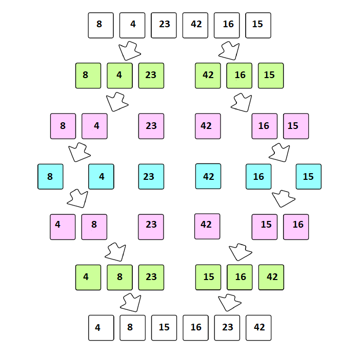

## Code Challenge: Class 27

### Merge Sort

**Pseudocode**

```
 ALGORITHM Mergesort(arr)
    DECLARE n <-- arr.length

    if n > 1
      DECLARE mid <-- n/2
      DECLARE left <-- arr[0...mid]
      DECLARE right <-- arr[mid...n]
      // sort the left side
      Mergesort(left)
      // sort the right side
      Mergesort(right)
      // merge the sorted left and right sides together
      Merge(left, right, arr)

ALGORITHM Merge(left, right, arr)
    DECLARE i <-- 0
    DECLARE j <-- 0
    DECLARE k <-- 0

    while i < left.length && j < right.length
        if left[i] <= right[j]
            arr[k] <-- left[i]
            i <-- i + 1
        else
            arr[k] <-- right[j]
            j <-- j + 1

        k <-- k + 1

    if i = left.length
       set remaining entries in arr to remaining values in right
    else
       set remaining entries in arr to remaining values in left

```

**step-by-step output after each iteration**

a function called 'Mergesort' that takes an array as an argument and iterate over all elements 

Merge sort is the algorithm which follows divide and conquer approach. Consider an array A of n number of elements. The algorithm processes the elements in 3 steps.

1. If A Contains 0 or 1 elements then it is already sorted, otherwise, Divide A into two sub-array of equal number of elements.
2. Conquer means sort the two sub-arrays recursively using the merge sort.
3. Combine the sub-arrays to form a single final sorted array maintaining the ordering of the array.

The main idea behind merge sort is that, the short list takes less time to be sorted.

**-> From the step-by-step output we consider that this function will sort the array 'Merge Sort'**


**-> Visual of given array**

