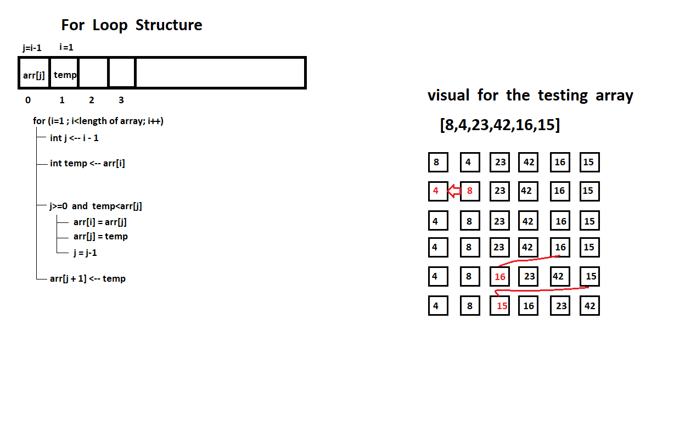

## Code Challenge: Class 26

### Insertion Sort

**Pseudocode**

```
 InsertionSort(int[] arr)

    FOR i = 1 to arr.length

      int j <-- i - 1
      int temp <-- arr[i]

      WHILE j >= 0 AND temp < arr[j]
        arr[j + 1] <-- arr[j]
        j <-- j - 1

      arr[j + 1] <-- temp

```

**step-by-step output after each iteration**

a function called 'InsertionSort' that takes an array as an argument and iterate over all elements 

- in each iterate a variable 'temp' will take the next element and store it and variable 'j && i ' will take the current and next index 
- a wihle loop will check wheater the index 'j' is more than zero and the variable 'temp' which indicate the next value is less than the current value or not
- if the condition is pass it will make a swap between the next and current value 
- this while loop will iterate until the value 'j' reach the zero or the condition faild which means that we arrived the best index to the element
- after that, a new for-loop iteration will be generated to repeat all procedures

**-> From the step-by-step output we consider that this function will sort the array 'insertion sort'**


**-> Visual of given array**

