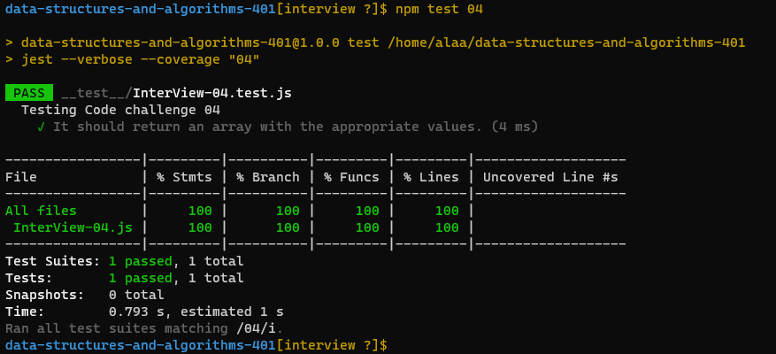
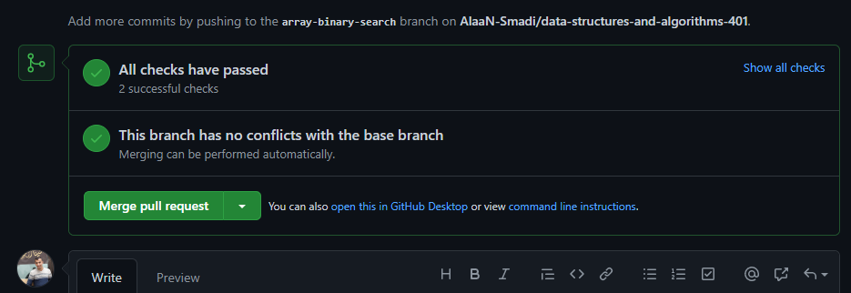
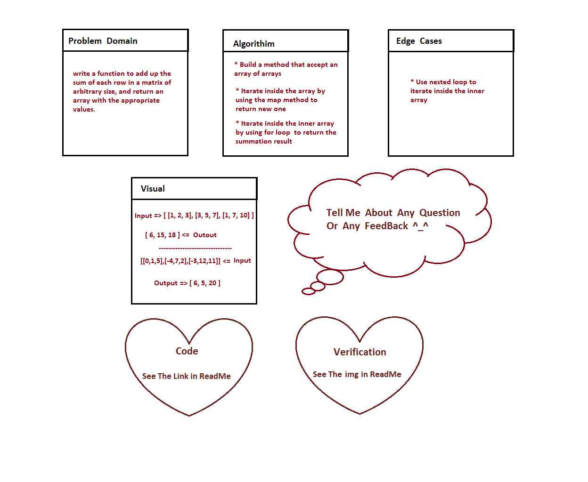

# data-structures-and-algorithms-401

# Code Challenge 04

# InterView  Question
<!-- Description of the challenge -->

link for code Challenge on GitHub.com : [Open Link](https://github.com/AlaaN-Smadi/data-structures-and-algorithms-401) 

link for testing code Challenge 04 on replit.com : [Open Link](https://replit.com/@AlaaNSmadi/WorstBriefInstructionset#script.js) 

It was nice challenge ;  all of knowledge we studied them in previous courses

## Whiteboard Process
<!-- Embedded whiteboard image -->
### Testing Image for code challenge 04
### To make Test for the code you have to type 'npm test 04' in the terminal 

<!--  -->

### Whiteboard Process Image for code challenge 04

## Approach & Efficiency
<!-- What approach did you take? Discuss Why. What is the Big O space/time for this approach? -->

I used for loop , map and quality test to make sure that all of my functions will work 
I used replit to test my functions before test them on VS Code

