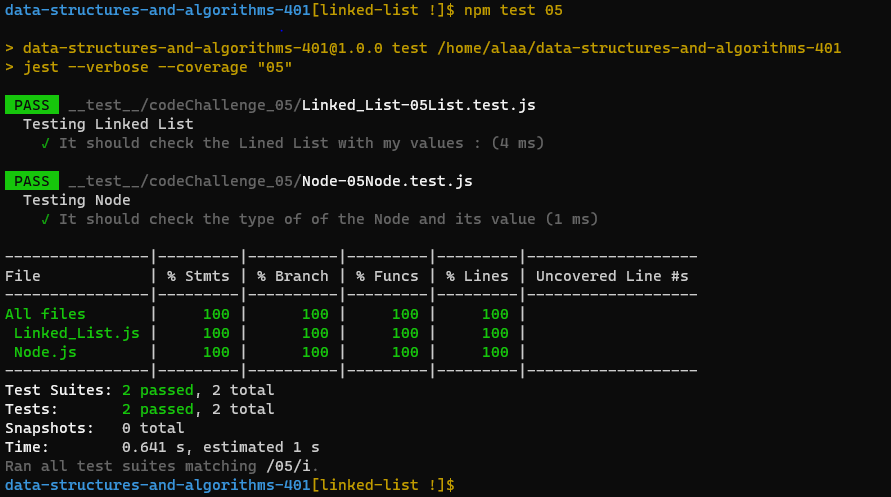
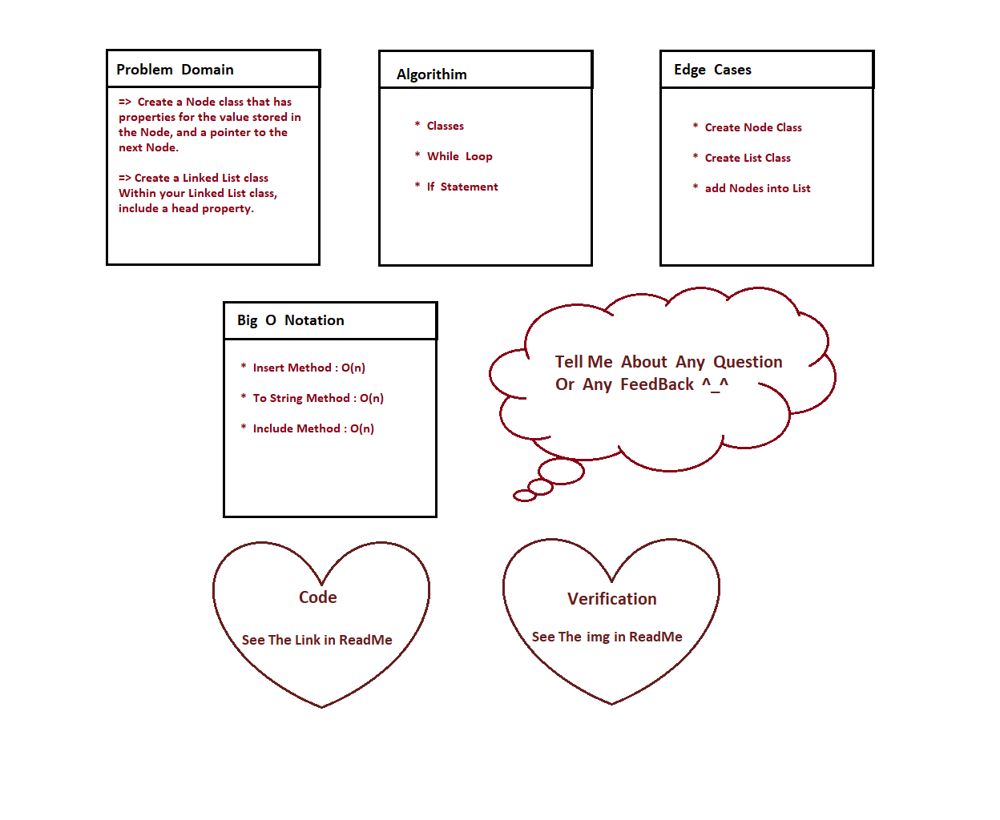

# data-structures-and-algorithms-401

# Code Challenge 05

# Singly Linked List
<!-- Short summary or background information -->

link for code Challenge on GitHub.com : [Open Link](https://github.com/AlaaN-Smadi/data-structures-and-algorithms-401) 

## API
<!-- Description of each method publicly available to your Linked List -->
### Testing Image for code challenge 05
### To make Test for the code you have to type 'npm test 05' in the terminal 
  

## Approach & Efficiency
<!-- What approach did you take? Why? What is the Big O space/time for this approach? -->
### Whiteboard Process Image for code challenge 05

 <!--  Need New Image  -->

## Approach & Efficiency
<!-- What approach did you take? Discuss Why. What is the Big O space/time for this approach? -->

I used while loop and quality test to make sure that all of my functions will work 
I used replit to test my functions before test them on VS Code

## Challenge
<!-- Description of the challenge -->

It was nice challenge ;  all of knowledge we studied them in previous courses
There was some issue but finally we solved it ^_^