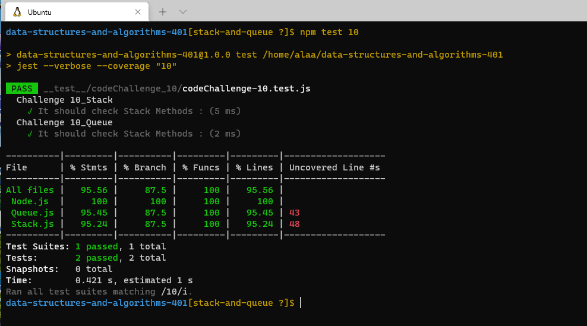
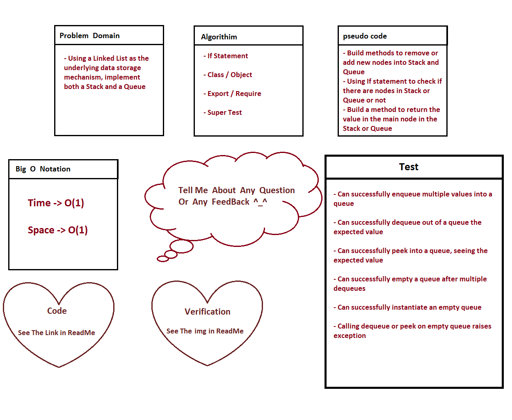

# data-structures-and-algorithms-401

# Code Challenge 10

# Challenge Summary
<!-- Description of the challenge -->
link for code Challenge on GitHub.com :=> [Open Link](https://github.com/AlaaN-Smadi/data-structures-and-algorithms-401) 

## Whiteboard Process
<!-- Embedded whiteboard image -->
### Testing Image for code challenge 10
### To make Test for the code you have to type 'npm test 10' in the terminal 

### Whiteboard for code challenge 10
 

## Approach & Efficiency
<!-- What approach did you take? Why? What is the Big O space/time for this approach? -->
I used class and quality test to make sure that all of my methods will work 

## Solution
<!-- Show how to run your code, and examples of it in action -->

Using a Linked List as the underlying data storage mechanism, implement both a Stack and a Queue

