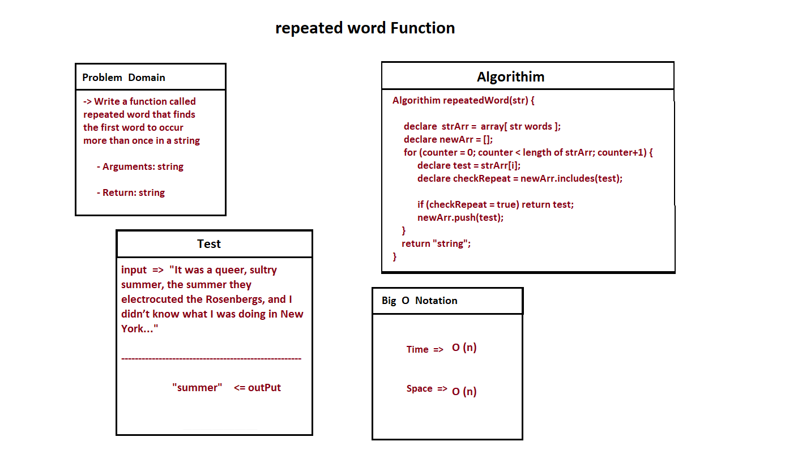

# Hashtables
<!-- Short summary or background information -->

## Challenge
<!-- Description of the challenge -->

Implement a Hashtable Class with the following methods:

- Write a function called repeated word that finds the first word to occur more than once in a string

    - Arguments: string
    - Return: string

# Whiteboard Process

# Approach & Efficiency

Big O Time <--- O(n) Space <----- O(n)

## API
<!-- Description of each method publicly available in each of your hashtable -->