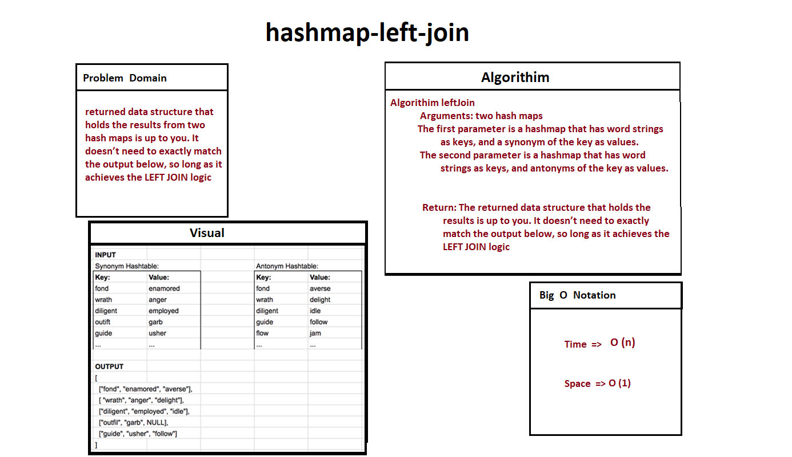
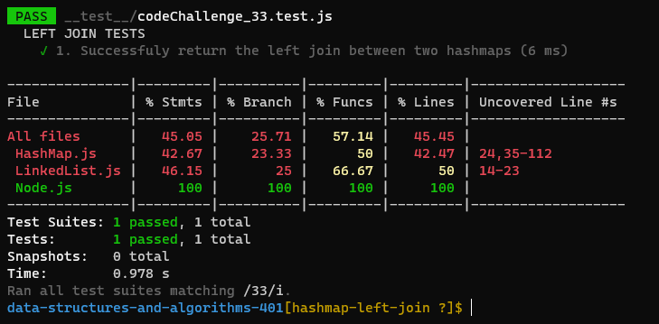

# Hashmap LEFT JOIN
<!-- Short summary or background information -->

LEFT JOIN returns all rows from the left table, even if there are no matches in the right table. This means that if the ON clause matches 0 (zero) records in the right table; the join will still return a row in the result, but with NULL in each column from the right table.

**This means that a left join returns all the values from the left table, plus matched values from the right table or NULL in case of no matching join predicate.**

## Challenge
<!-- Description of the challenge -->

## Approach & Efficiency
<!-- What approach did you take? Why? What is the Big O space/time for this approach? -->

## Solution
<!-- Embedded whiteboard image -->

### White Board 
 

### Testing 

